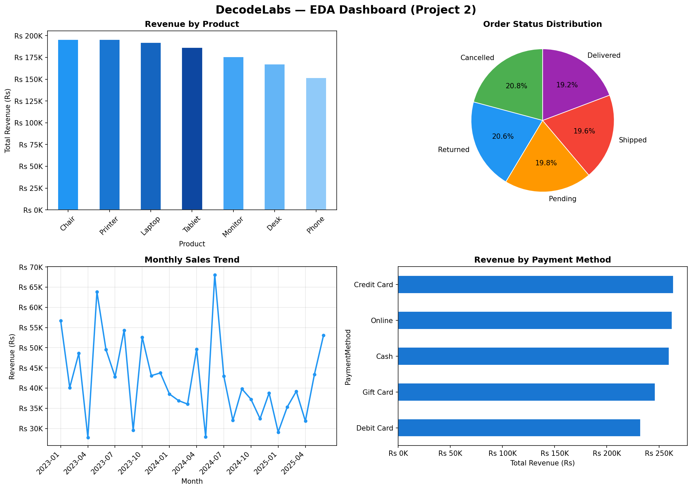

# 📊 Project 2 — Exploratory Data Analysis (EDA)

> **Intern:** Data Analytics Track  
> **Organization:** [DecodeLabs.tech](https://www.decodelabs.tech)  
> **Batch:** 17-May-2026 to 17-june-2026                 
> **Dataset:** Cleaned E-Commerce Orders — 1,200 rows

---

## 🎯 Goal

Explore the cleaned dataset to discover hidden patterns, trends, and outliers. Turn numbers into meaningful business insights.

---

## 🔍 What This Project Does

### Step 1 — Load Dataset
- Loaded cleaned dataset with 1,200 rows

### Step 2 — Descriptive Statistics
- Calculated mean, median, min, max for all numeric columns
- Generated full business summary

### Step 3 — Sales by Product
- Grouped revenue and order count by each product
- Identified top and bottom performers

### Step 4 — Order Status Distribution
- Analyzed breakdown of Delivered, Cancelled, Returned, Shipped, Pending

### Step 5 — Payment Method Analysis
- Compared order count and revenue across all payment methods

### Step 6 — Monthly Sales Trend
- Tracked revenue month by month from 2023 to 2025

### Step 7 — Outlier Detection
- Used IQR method to detect high-value outlier orders

### Step 8 — Referral Source Analysis
- Compared Instagram, Email, Google, Facebook, Referral performance

### Step 9 — Visualizations
- Generated 4-chart dashboard saved as PNG

### Step 10 — Key Insights Summary
- Printed final business summary with top performers

---

## 📊 Key Findings

| Metric | Value |
|--------|-------|
| Total Revenue | Rs 12,64,762 |
| Total Orders | 1,200 |
| Unique Customers | 1,189 |
| Avg Order Value | Rs 1,054 |
| Median Order Value | Rs 824 |
| Highest Single Order | Rs 3,456 |
| Top Product | Chair (Rs 1,95,620) |
| Top Payment Method | Credit Card (Rs 2,63,848) |
| Best Referral Source | Instagram (259 orders) |
| Best Sales Month | June 2024 (Rs 68,069) |
| Outliers Detected | 8 high-value orders |

---

## 📈 EDA Dashboard



> 4 charts in one view: Revenue by Product, Order Status Distribution, Monthly Sales Trend, Revenue by Payment Method.

---

## ⚙️ How to Run

```bash
# Step 1 — Install required libraries
pip install pandas matplotlib openpyxl

# Step 2 — Run the script
python project2_eda.py
```

**Output:** `eda_dashboard.png` will be generated in the same folder.

---

## 🛠️ Tech Stack


---

## 🏢 About DecodeLabs

**DecodeLabs.tech** — Industrial Training Program for aspiring developers and data analysts.  
📍 Greater Lucknow, India  
🌐 [www.decodelabs.tech](https://www.decodelabs.tech)

---

*Part of DecodeLabs Industrial Training — Batch 2026*
